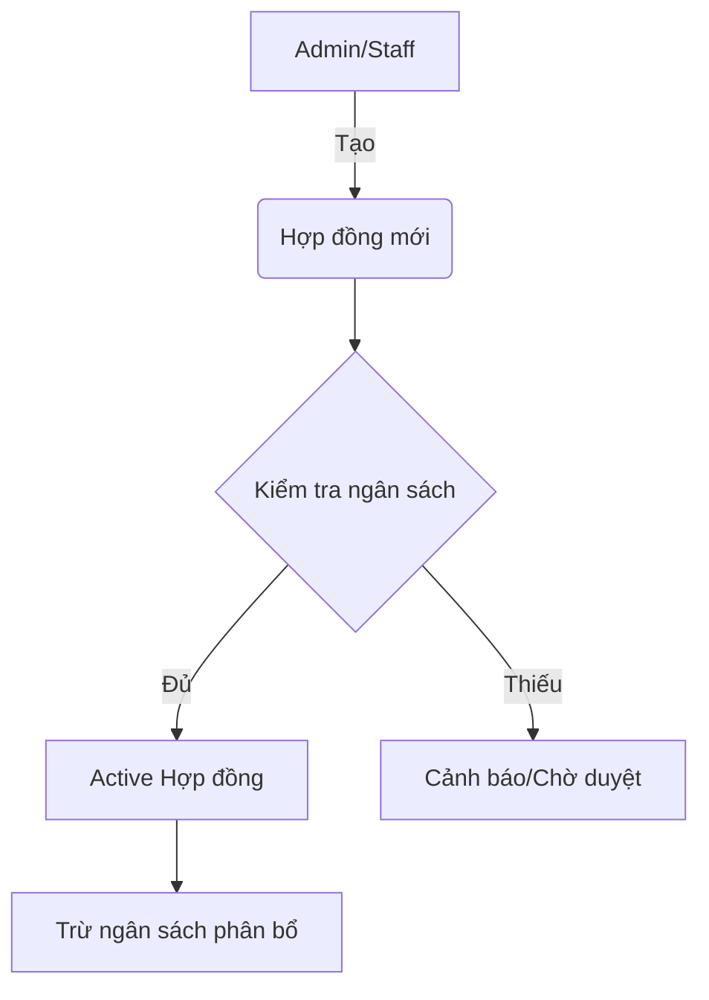

# Specs: Hệ thống Quản lý Hợp đồng & Ngân sách (Pivot)

## 🎯 Mục tiêu
Xây dựng lại hệ thống quản lý hợp đồng và phân bổ ngân sách theo hướng tối ưu cho việc deploy lên **Vercel**, đơn giản hóa cấu trúc để team nhỏ (2-10 người) dễ dàng sử dụng và duy trì.

## 🏗️ Kiến trúc đề xuất: Unified Next.js
- **Frontend + Backend (API)**: Hợp nhất tất cả vào `apps/web` (Next.js App Router).
- **Database**: Tiếp tục dùng Prisma + PostgreSQL (Supabase/Railway).
- **Deployment**: Vercel (Frontend & Serverless API).
- **CI/CD**: GitHub Actions hoặc Vercel Git Integration.

## 📦 Tính năng chính (New Features)
1. **Quản lý Hợp đồng (Contracts)**:
   - Lưu trữ thông tin pháp nhân, giá trị, thời hạn.
   - Theo dõi trạng thái (Draft, Active, Expired).
2. **Phân bổ Ngân sách (Budget Allocation)**:
   - Định nghĩa ngân sách tổng cho từng phòng ban/dự án.
   - Tự động trừ ngân sách khi có hợp đồng mới.
   - Cảnh báo khi vượt hạn mức ngân sách.
3. **Phân quyền Team (Roles)**:
   - Admin: Quản lý toàn bộ.
   - Staff: Soạn thảo hợp đồng.
   - Finance: Duyệt ngân sách.

## 📊 Luồng hoạt động (Mermaid)

## 🛠️ Tech Stack
- **Framework**: Next.js 15
- **Styling**: Vanilla CSS (Design Tokens)
- **Database**: Prisma + PostgreSQL
- **Auth**: JWT (Internal Session)
